# Virtuus 善

A **virtual-table database system** — a file-backed, in-memory indexed table engine. Virtuus treats folders of JSON files as indexed tables — like DynamoDB tables backed by the filesystem.

[](https://github.com/AnthusAI/Virtuus/actions/workflows/ci.yml)


[](https://pypi.org/project/virtuus/)
[](https://crates.io/crates/virtuus)
[](LICENSE)

Data lives on disk as one JSON file per record. In many use cases, you can **eliminate the database entirely**: load JSON files from disk, build indexes and associations like DynamoDB, and serve fast queries with no external dependencies. In our benchmarks, a **single table loads in a couple of milliseconds** at ~10k total records, and a **full three-table dataset loads in under half a second**; **warm primary-key lookups stay well under a millisecond**. Virtuus loads data into memory, builds indexes, and provides fast query access with DynamoDB-style Global Secondary Indexes, associations, pagination, and a nested query interface — a **virtual-table** experience backed by the filesystem. Writes persist back to disk atomically.

## Motivation / Operating Context

Virtuus was built to take [Plexus](https://github.com/AnthusAI/Plexus) — one of our mission-critical production systems — into more regulated, isolated environments. Plexus uses a GraphQL control plane and serves high-availability, high-throughput, high-volume workloads under strict regulatory and information-security constraints. Our motivation is to support scenarios where workers must run in tightly regulated environments and cannot directly reach the central control plane. Shipping the data and query engine with the worker removes that dependency while keeping the API shape consistent.

## Guiding Values

- **It's better to eliminate a problem than to solve it.** Ask whether you truly need a database and the lifetime cost it adds; the filesystem may already be enough.
- **Gherkin behavior specifications are the source code.** The Gherkin spec is the single source of truth; Rust and Python implementations are generated artifacts.
- **Raise the bar.** Use AI to raise the bar, not to just create more AI slop faster.
- **The filesystem is the database.** JSON files back both Kanbus project management and the core table engine.
- **You can’t optimize what you don’t measure.** Benchmarks are first-class.

## Load-First Runtime Pattern

We increasingly run systems that are **load-first**: large ML models and multi-GB datasets are loaded before any work can begin. If multi-second or multi-minute loads are already normal for model startup, the same time-shifted assumption can simplify data querying problems: load once, index in memory, and operate fast. You don’t need traditional ETL (extract-transform-load) to get indexed access if you can load a folder and build the indexes directly in memory. That’s the core **virtual-table** mindset.

## Performance Highlights

- In Rust, a single table loads in a tiny fraction of a second, even at 100k total records (tens of milliseconds).
- In Rust, a full, structured database (users/posts/comments + indexes + associations) loads in under a second at ~10k total records.
- Once warm, PK (primary key) lookups feel instant and GSIs (Global Secondary Indexes) remain low-latency as size grows.
- Rust provides more headroom on cold loads and index-heavy queries; Python stays strong for smaller deployments.
- Incremental refreshes are cheap; full reloads are for true cold starts.

Backed by the benchmark charts below; exact values are in the charts and REPORT.

## Eliminate the Database, Don’t Optimize It

This pattern showed up in [Kanbus](https://github.com/AnthusAI/Kanbus), inspired by [Beads](https://github.com/steveyegge/beads). Beads uses a SQLite sidecar to index a JSONL file. Kanbus asked: what if we just load the JSONL and scan it directly?

The traditional answer here is “run a local database” (Mongo, Redis, SQLite, etc.), then do ETL, orchestrate it in a container, keep it synchronized, and build repair tooling for drift and corruption. Virtuus changes the game by cutting that whole layer out.

The benchmark results were decisive. In that case, scanning JSON directly beat the SQLite index by a wide margin while eliminating a daemon and synchronization layer. It’s often better to eliminate a problem than to solve it.

See the Kanbus architecture notes for the exact benchmark tables and raw measurements.

## When to Use

- Ship data + query engine in the same container with no external DB, including isolated or regulated environments where the control plane cannot be reached.
- Time-shift a one-time cold load to unlock extremely fast PK lookups and low-latency GSI queries.
- DynamoDB-style GSIs, associations, pagination, and nested queries without bringing in DynamoDB.
- A drop-in GraphQL replacement for batch or edge processing, driven by JSON exports.

## When Not to Use

- You cannot tolerate noticeable cold-start latency or your memory budget is tight for in-memory indexing.
- You have multi-million-record tables that demand SSD-backed columnar storage.
- You need cross-node clustering or distributed consensus.
- You require ACID transactions or high write concurrency.

## Core Concepts & Features

### Storage Model

One directory per table, one JSON file per record:

```
data/
  users/
    user-abc-123.json
    user-def-456.json
  posts/
    post-001.json
    post-002.json
```

On startup, Virtuus scans each directory, loads all JSON files into memory, and builds GSI indexes. On write (`put`/`delete`), changes go to memory and to disk via atomic temp-file + rename.

### Schema Definition

Define tables, GSIs, and associations in a declarative YAML file:

```yaml
tables:
  users:
    primary_key: id
    directory: users
    gsis:
      by_email: { partition_key: email }
      by_org: { partition_key: org_id }
    associations:
      posts: { type: has_many, table: posts, index: by_user }
  posts:
    primary_key: id
    directory: posts
    gsis:
      by_user: { partition_key: user_id, sort_key: created_at }
    associations:
      author: { type: belongs_to, table: users, foreign_key: user_id }
```

### Global Secondary Indexes (GSIs)

GSIs provide fast lookups by non-primary-key fields. Each GSI has a hash partition key and an optional sorted range key.

Sort conditions on range keys support: `eq`, `ne`, `lt`, `lte`, `gt`, `gte`, `between`, `begins_with`, `contains`.

### Query Interface

`db.execute(query_dict)` accepts a nested dict and returns nested results:

| Directive | Purpose |
|-----------|---------|
| `where` | Filter by field values |
| `index` | GSI name for indexed lookup |
| `pk` | Direct primary key lookup |
| `fields` | Field projection |
| `limit` | Max records returned |
| `sort` | Sort condition on range key |
| `sort_direction` | `asc` or `desc` (default: `asc`) |
| `next_token` | Cursor for pagination |
| `include` | Nested association resolution |

### Associations

| Type | Resolution |
|------|-----------|
| `has_many` | GSI query on foreign table |
| `belongs_to` | PK lookup on foreign table |
| `has_many_through` | GSI query on junction table, then PK lookups on target |

Self-referential associations (parent/child trees) are supported.

### Cache & Freshness

Virtuus tracks file modification times and detects when data on disk has changed:

- **JIT refresh**: Stale tables are automatically refreshed before query results are returned.
- **Warm reindex**: Proactively refresh all tables with `db.warm()` before queries need it.
- **Incremental refresh**: Only added, modified, and deleted files are reloaded — not the entire table.
- **Two-tier detection**: Cheap O(1) directory mtime check first; full O(N) file scan only when the directory has changed.

### Diagnostics & Quality-of-Life

- `table.describe()` / `db.describe()` — metadata overview: name, PK, GSIs, associations, record count, staleness
- `table.count()` / `table.count(index, value)` — record counts without materializing results
- `table.check()` — dry-run refresh showing what would change without actually refreshing
- `db.validate()` — referential integrity check across all `belongs_to` associations
- `table.export(directory)` — write all in-memory records back to JSON files
- Event hooks: `on_put`, `on_delete`, `on_refresh` callback lists for logging, metrics, or reactive patterns
- Opt-in put validation: warn or error when records are missing PK or GSI-indexed fields

### Dual Implementation

Virtuus is implemented identically in both Rust and Python, driven by shared Gherkin behavior specifications:

- **Python**: Pure Python implementation in `python/src/virtuus/_python/`
- **Rust**: Native implementation in `rust/src/`
- **Shared specs**: Gherkin feature files in `features/` are the single source of truth
- **PyO3 bridge**: The Rust implementation compiles as a Python extension module via PyO3 + maturin

Philosophy: start fast in Python, flip to Rust when ready. Development can begin immediately with the pure-Python backend (no toolchain needed). In production, install a Rust toolchain and the same import automatically loads the Rust backend for a drop-in speed bump—no API changes, just a faster engine.

Both implementations maintain 100% test coverage at all times.

## Installation

Three installation paths, one codebase:

```bash
# Rust standalone (fastest)
cargo install virtuus

# Pure Python (works anywhere)
pip install virtuus

# Python with bundled Rust backend (automatic if Rust toolchain is available)
pip install virtuus
```

The Python package transparently uses the Rust backend when available, falling back to pure Python:

```python
from virtuus import Database, Table, GSI, Sort
```

## Quick Start

### As a Library

```python
from virtuus import Database

# Load from a YAML schema + data directory
db = Database.from_schema("schema.yml", "./data")

# Or build programmatically from a dict schema
schema = {"tables": {"users": {"primary_key": "id", "directory": "users"}}}
db = Database.from_schema_dict(schema, "./data")

# Query by primary key
user = db.execute({"users": {"pk": "user-123"}})

# Query by index
posts = db.execute({
    "posts": {
        "index": "by_user",
        "where": {"user_id": "user-123"},
        "sort_direction": "desc",
        "limit": 10,
    }
})

# Nested query with associations
result = db.execute({
    "users": {
        "pk": "user-123",
        "include": {
            "posts": {
                "limit": 5,
                "include": {"comments": {}}
            }
        }
    }
})
```

### As a CLI

```bash
# One-shot query
virtuus query --dir ./data --table users --index by_email --where email=alice@example.com

# Persistent HTTP server
virtuus serve --dir ./data --schema schema.yml --port 8080
```

The server accepts POST requests with JSON query dicts and returns JSON results.

## Examples (Sakila)

Examples live under `examples/sakila/` and use a small Sakila-derived dataset. Generate the JSON data with:

```bash
conda run -n virtuus python examples/sakila/build_sakila.py
```

Lessons and runnable examples (Python + Rust):

- [Lesson 01: Load a Table](examples/sakila/01_load_table.md) — shows how to load the schema and fetch a single record by primary key, which is the simplest and fastest query path. Code: [python](examples/sakila/python/01_load_table.py), [rust](examples/sakila/rust/src/bin/01_load_table.rs).
- [Lesson 02: GSI Query](examples/sakila/02_gsi_query.md) — demonstrates querying by a non-primary key using a Global Secondary Index and explains the required partition key constraint. Code: [python](examples/sakila/python/02_gsi_query.py), [rust](examples/sakila/rust/src/bin/02_gsi_query.rs).
- [Lesson 03: Associations](examples/sakila/03_associations.md) — uses `include` to resolve `belongs_to` and `has_many` relationships in a single query response, showing how Virtuus emulates joins through indexes. Code: [python](examples/sakila/python/03_associations.py), [rust](examples/sakila/rust/src/bin/03_associations.rs).
- [Lesson 04: has_many_through](examples/sakila/04_has_many_through.md) — walks a many-to-many association through a junction table, illustrating how to model cross-table relationships without SQL joins. Code: [python](examples/sakila/python/04_has_many_through.py), [rust](examples/sakila/rust/src/bin/04_has_many_through.rs).
- [Lesson 05: Pagination](examples/sakila/05_pagination.md) — demonstrates cursor-style pagination with `limit` and `next_token`, plus field projection to keep payloads lean. Code: [python](examples/sakila/python/05_pagination.py), [rust](examples/sakila/rust/src/bin/05_pagination.rs).

## Benchmarks

Benchmark goal: validate that Virtuus stays snappy for “small” datasets and that a container can carry its own data + engine without external dependencies. Warm-cache results are shown because most workloads in containers keep hot data in memory; cold-load numbers indicate one-time costs.

### Setup

- Fixture profile: `social_media` (users/posts/comments with GSIs)
- Sizes: 100, 500, 1k, 5k, 10k, 50k, 100k total records
- Environment: local filesystem, warm cache, Python runner using Rust backend when available
- Metrics: cold load (single table and full DB), incremental refresh, PK lookup, GSI hash-only lookup, GSI sorted lookup (range key)

### Results (Rust backend, warm cache)

The Rust backend represents the “production” path: same API, faster engine, still file-backed.

For cold-load charts, “full database” means loading every table (users, posts, comments) and building all indexes; “single table” means loading just the users table (and its indexes) in isolation. At ~10k total records, that’s roughly ~160 users, ~1.6k posts, and ~8.2k comments (1:10:50 ratio). Full-database loads touch far more records and build more indexes, so they take longer.

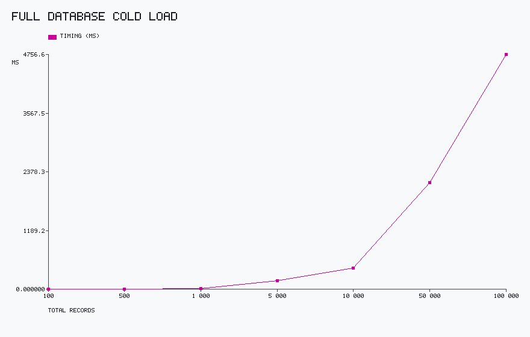
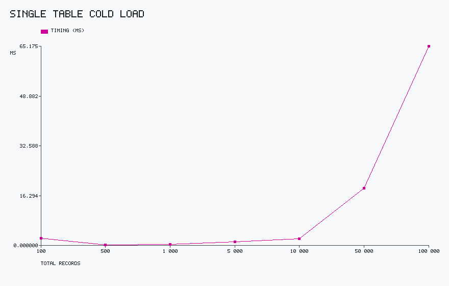
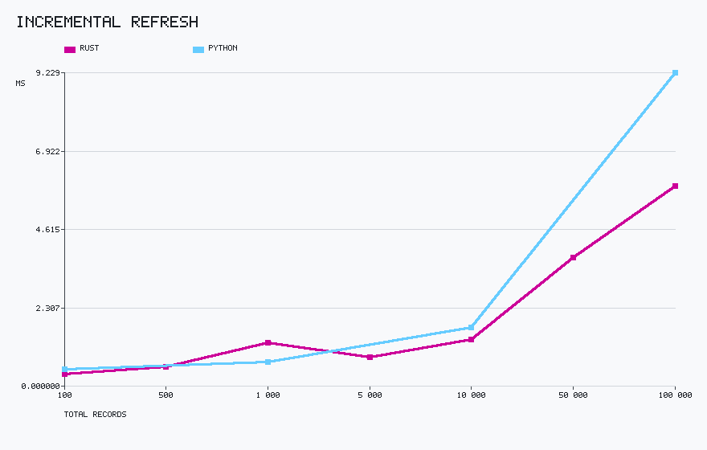
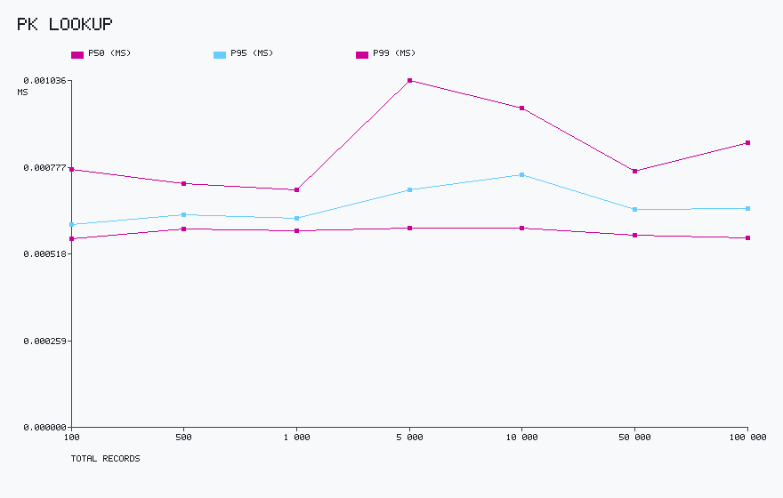
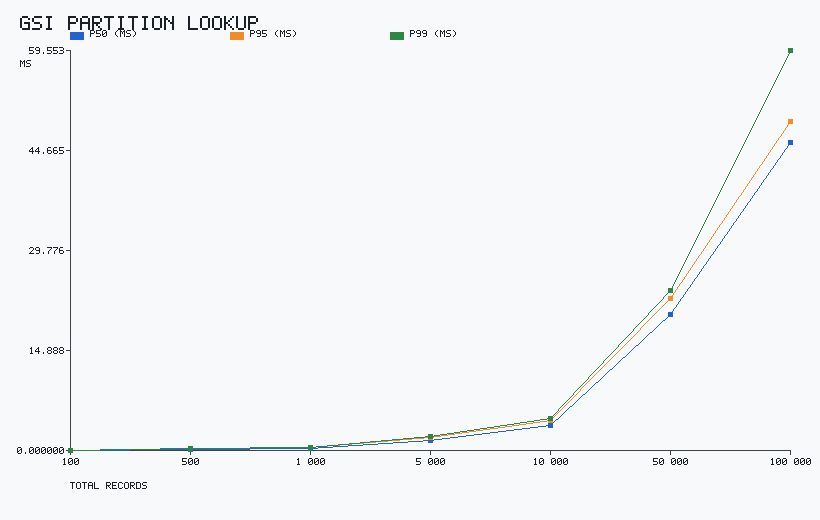
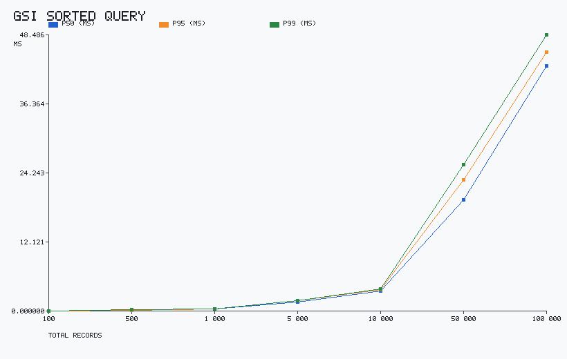

- Cold loads scale cleanly; single-table loads remain fast even at larger totals.
- Warm PK lookups are effectively constant; GSI queries stay low-latency.
- See charts for exact values.

### Results (Python backend, warm cache — Rust overlay)

We ran Python backend benchmarks at 100, 1k, 10k, and 100k totals to mirror the small-footprint use case. The charts overlay Rust for comparison (p95 for iterative benchmarks, timing_ms for cold loads):

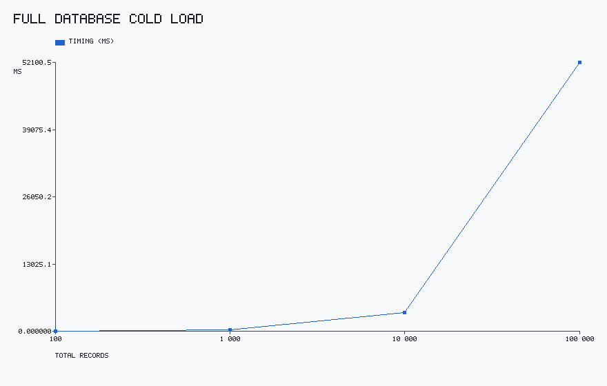
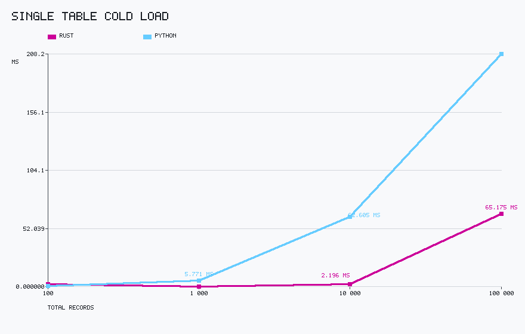
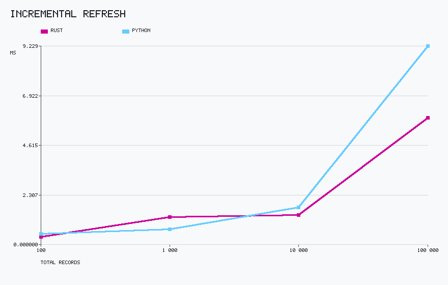
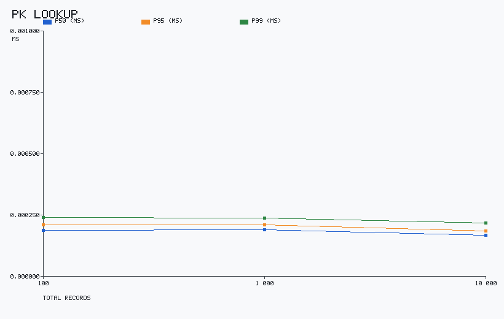
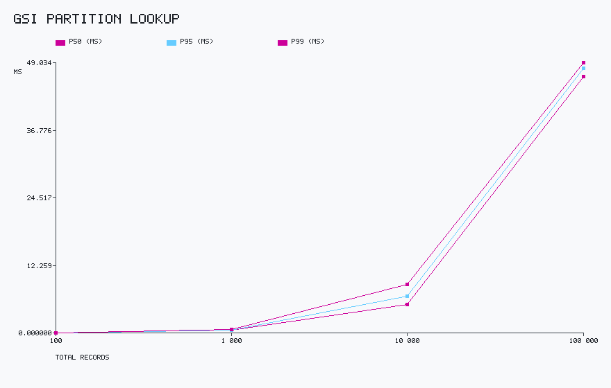
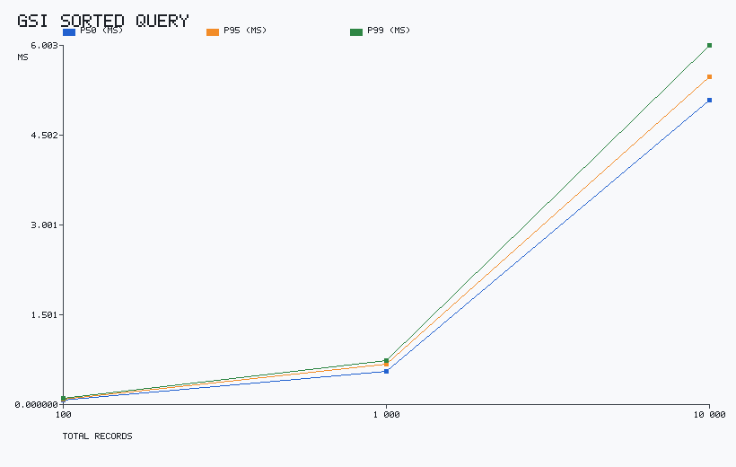

- Python remains solid for smaller deployments; charts show the headroom gap at larger sizes.
- Warm lookups stay fast; cold loads are the main differentiator.
- See charts for exact values.

### Rust vs Python comparison (p95 or timing_ms)

Side-by-side bars for each benchmark at common corpus sizes. Values are p95 for iterative benchmarks and timing_ms for cold loads. Cold loads are charted separately so all charts can share a zero-based scale.

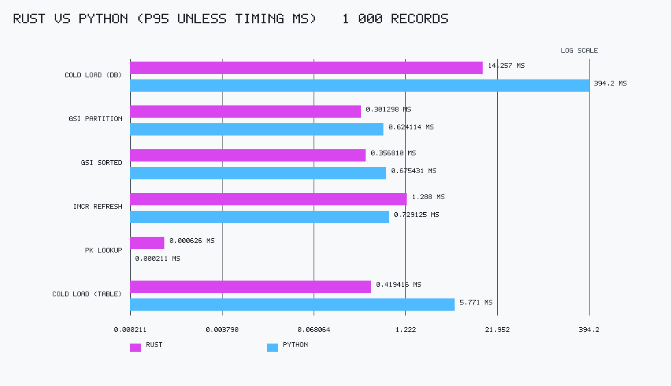
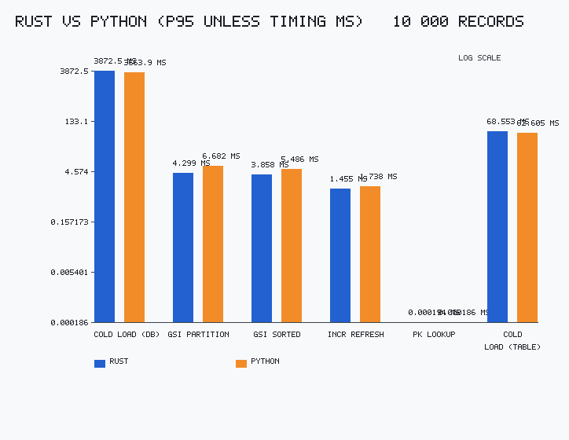
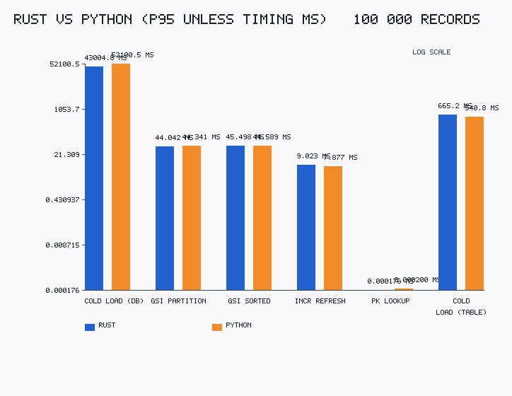
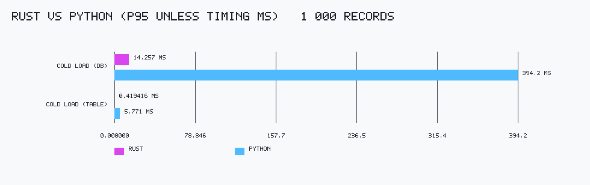
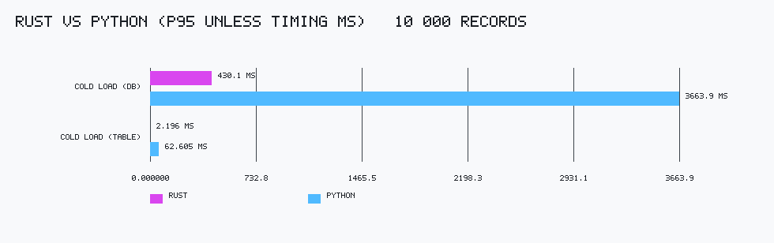
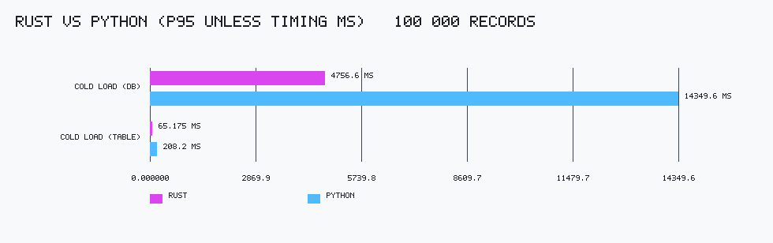

### Memory footprint (RSS) snapshots

RSS (Resident Set Size) is the portion of a process's memory that is actually resident in RAM. We measure it after the server loads pre-generated JSON datasets, varying corpus size and GSI count (with `posts` associations enabled), then query the `memory` endpoint for a steady-state snapshot.

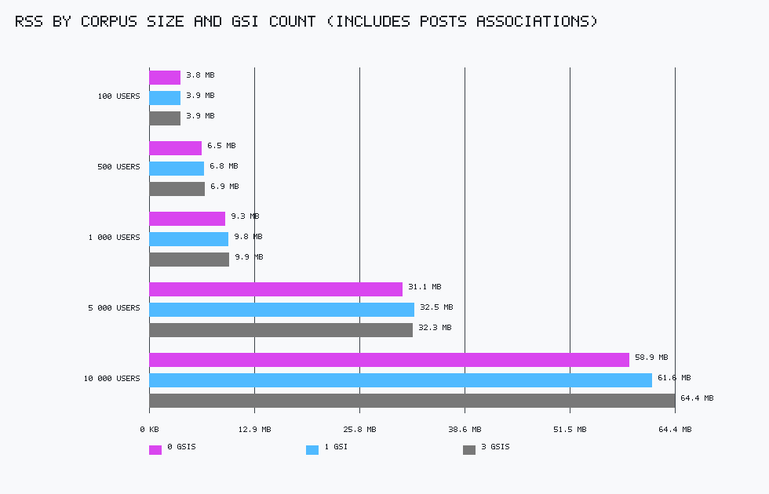

Interpretation:

- 100–1k users with posts and 3 GSIs stay around ~4–10 MB RSS.
- At 10k users, RSS is ~64 MB with posts and 3 GSIs.
- Adding GSIs has a modest cost in RSS at this scale; associations are included.

See `benchmarks/output_memory/results.csv` for raw numbers.

### Practical takeaways

- Load-first then operate: cold-load is the tradeoff; warm lookups stay fast.
- Rust vs Python gap is most pronounced in cold loads; warm lookups remain fast in both.
- GSI costs grow with partition size; see charts for how this scales.
- Incremental refresh is the preferred path to keep data fresh without full reloads.
- Memory footprint scales predictably with record and index count; see charts for specifics.

### Interpretation

- Virtuus fits small-to-mid deployments where you can pay a one-time load and then serve low-latency lookups.
- Use the Rust backend when cold-load headroom matters; Python remains viable for smaller tables.
- If range queries dominate, keep partitions small or pre-sort buckets on write; incremental refresh is preferred to full reloads.
- The time-shifted model aligns with isolated environments where you want data + engine co-located.

### How to regenerate

```bash
VIRTUUS_BENCH_DIR=benchmarks/output VIRTUUS_BENCH_TOTALS=100,500,1000,5000,10000,50000,100000 \
  python -m behave features/benchmarks/benchmark_scenarios.feature -n "Visualization generates charts"

VIRTUUS_BENCH_BACKEND=python \
VIRTUUS_BENCH_DIR=benchmarks/output_py \
VIRTUUS_BENCH_TOTALS=100,1000,10000,100000 \
  python tools/run_python_benchmarks.py

# Generate cross-backend comparison charts
python tools/bench_compare.py
```
Outputs land in `benchmarks/output/REPORT.md`, `benchmarks/output/benchmarks.json`, and `benchmarks/output/charts/*.png`.

```bash
make bench PROFILE=social_media SCALE=2
make bench-scale    # run at 1x, 2x, 5x, 10x for scaling charts
```

## Development

```bash
make check              # lint + specs + coverage + parity — the one command
make coverage-python    # behave + coverage report --fail-under=100
make coverage-rust      # cargo tarpaulin --fail-under 100
make check-parity       # verify Python and Rust step definitions cover all Gherkin steps
make bench              # run benchmarks + generate visualizations
```

## Release Automation

Semantic Release bumps versions and publishes tags, PyPI, and crates.io automatically from conventional commits. Push a `feat:` commit to cut a new minor (e.g., 0.2.0) across both ecosystems; fixes/docs/chore still ship as patch releases. Releases are gated on CI success to avoid partial publishes. Conventional commits are the single switch for automated releases.

## License

MIT License. See `LICENSE`.
